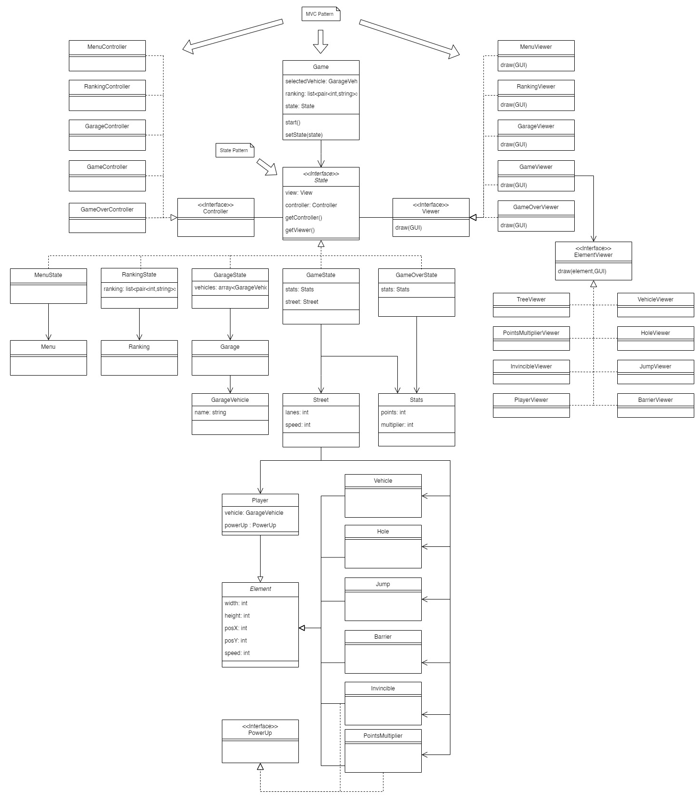

## LDTS_<02><03> - <AsphaltRush>

The main objective of the game is to guide a car as far as possible, avoiding obstacles such as other cars, holes, and barriers while accumulating points to climb the rankings.

This project was developed by:

*Bruno Ferreira* (up202207863@fe.up.pt)
*Eduardo Ferreira* (up202206628@fe.up.pt)
*Ricardo Parreira* (up202205091@fe.up.pt)
*Xavier Martins* (up202206632@fe.up.pt)

 for LDTS 23/24

## UML

    

## IMPLEMENTED FEATURES

- **None**

## PLANNED FEATURES

#### Car Selection in Garage
Players can choose from a variety of cars available in the garage before starting the game.
  
#### Scoring System
The game features a scoring system that increases as the player covers greater distances, accumulating points.
  
#### Ranking Display
The best scores are showcased on a ranking screen, fostering healthy competition among players.
  
#### Obstacle Variety
Various obstacles, including moving cars, holes in the track, jumps and barriers, that challenges the player during gameplay.

#### Power ups
Implemented two power ups:
  - *Score Multiplier Power Up* - Temporarily boosts the points earned by multiplying them by a specific factor.
  - *Invincibility Power up* - Grants temporary invulnerability, allowing the player to pass through obstacles without losing.

#### Game Over Screen 
When a player collides with an obstacle and loses, a game over screen is displayed. It shows the obtained score, the player's ranking position, and provides options to restart the game or return to the main screen.

## DESIGN

### Architectural Pattern

#### Problem in Context

The way we set up the project is super important. It's the game's foundation, and picking the right way to do it early on is key. Changing it later in the game-making process can be a big challenge and create a lot of problems.

#### The Pattern

We have applied the **MVC (Model-View-Controller)** pattern. This pattern is important in order to promote a better organization to the project, having three components:
Model: Responsible for managing the data, processing user inputs, and enforcing the business rules of the application.
View: Responsible for representing the data to the user and capturing user input
Controller: Responsible for handling user interactions and updating the Model and View as necessary

#### Implementation

See the UML

#### Consequences

The use of the MVC Pattern in the current design allows the following benefits:

Modularity
Reusability
Testability
Scability

### Game mode

#### Problem in Context

The game can be either in a Menu, Ranking, Garage Menu, Game or in a Game Over state.

#### The Pattern

We have applied the **State** pattern. This pattern allows you to represent different states with different subclasses. We can switch to a different state of the application by switching to another implementation (i.e., another subclass).

#### Implementation

See the UML

#### Consequences

The use of the State Pattern in the current design allows the following benefits:

- The several states that represent the different game states become explicit in the code, instead of relying on a series of flags.
- We don’t need to have a long set of conditional if or switch statements associated with the various states; instead, polymorphism is used to activate the right behavior.
- There are now more classes and instances to manage, but still in a reasonable number.

### Images

#### Problem in Context

When considering the best way to store the image information of each element we encountered a problem. Having that information hard written inside each element object would be impractical, difficult to change. On the other hand, we could store the images as separate files that would be read once the objects were created, but this approach would also cause some unnecessary overhead since a lot of the elements have the same texture. 

#### The Pattern

We have applied the **Flyweight** pattern. This pattern is used to minimize memory usage or computational expenses by sharing as much as possible with related objects. So, in a game like this one, where we have similar elements, it's a way of minimizing the memory usage. In this concrete case, different elements with the same texture would use the same Image Class, avoiding unnecessary loading of textures.

#### Implementation

#### Consequences

The use of the Flyweight Pattern in the current design allows the following benefits:

Memory Efficiency - By sharing common state, the Flyweight pattern reduces the memory footprint of an application, especially when dealing with a large number of instances.
Performance Improvement - Sharing common state can lead to performance improvements, as the overhead associated with managing redundant data is minimized.

### SELF-EVALUATION

Bruno Ferreira: 25%
Eduardo Portugal: 25%
Ricardo Parreira: 25%
Xavier Martins: 25%

