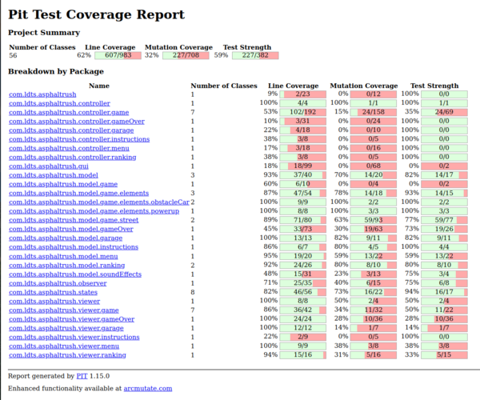

# LDTS_T02_G03 - AsphaltRush

The main objective of this game is to guide a car as far as possible, avoiding obstacles such as cars and holes, while accumulating points to climb the rankings.

This project was developed by:

*Bruno Ferreira* (up202207863@fe.up.pt)

*Eduardo Ferreira* (up202206628@fe.up.pt)

*Ricardo Parreira* (up202205091@fe.up.pt)

*Xavier Martins* (up202206632@fe.up.pt)

 for LDTS 23/24

## Game Demo

## IMPLEMENTED FEATURES

### Car Selection in Garage
Players can choose from a variety of cars available in the garage before starting the game.

### Scoring System
The game features a scoring system that increases as the player covers greater distances, accumulating points.

### Ranking Display
The best scores are showcased on a ranking screen, fostering healthy competition among players.

### Obstacle Variety
Various obstacles, including moving cars and holes in the track that challenges the player during gameplay.

### Power ups
Implemented two power ups:
  - ***Score Multiplier Power Up*** - Temporarily boosts the points earned by multiplying them by a specific factor.

    

  - ***Invincibility Power up*** - Grants temporary invulnerability, allowing the player to pass through obstacles without losing.
    
    

### Game Over Screen 
After colliding with an obstacle and losing, the game over screen displays the score and lets the player input their name for the best player's ranking.

### Game Sound
This game offers an audio experience with a background song playing throughout most of the game. There's also a special tune when the player loses to add some drama. Plus, there are various sound effects that kick in during specific moments, making the gaming experience even more immersive.

## PLANNED FEATURES

### Diverse Game Zones
Experience dynamic gameplay as the environment transforms, entering in different zones such as deserts or icy landscapes.

### Expanded Car Selection
More variety of cars in the garage.

### Obstacle Variety
Encounter new obstacles, such as barriers and oil spills.

### Diverse Power ups
Have a more distinct array of power-ups, such as time freezing, jumping or miniaturization.

### In-Game Shop
Introduce an in-game shop where players can utilize coins, collected during the game, to unlock new cars.

## DESIGN

### Architectural Pattern

#### Problem in Context

The way we set up the project is super important. It's the game's foundation, and picking the right way to do it early on is key. Changing it later in the game-making process can be a big challenge and create a lot of problems.

#### The Pattern

We have applied the **MVC (Model-View-Controller)** pattern. This pattern is important in order to promote a better organization to the project, having three components:
Model: Responsible for managing the data, processing user inputs, and enforcing the business rules of the application.
View: Responsible for representing the data to the user and capturing user input
Controller: Responsible for handling user interactions and updating the Model and View as necessary

#### Implementation

#### Consequences

The use of the MVC Pattern in the current design allows the following benefits:

- Modularity
- Reusability
- Testability
- Scalability

### Game mode

#### Problem in Context

The game can be either in a Menu, Ranking, Garage Menu, Game or in a Game Over state.

#### The Pattern

We have applied the **State** pattern. This pattern allows you to represent different states with different subclasses. We can switch to a different state of the application by switching to another implementation (i.e., another subclass).

#### Implementation

#### Consequences

The use of the State Pattern in the current design allows the following benefits:

- The several states that represent the different game states become explicit in the code, instead of relying on a series of flags.
- We don’t need to have a long set of conditional if or switch statements associated with the various states; instead, polymorphism is used to activate the right behavior.
- There are now more classes and instances to manage, but still in a reasonable number.

### Images

#### Problem in Context

The game involves handling a large number of images, leading to potential memory constraints.

#### The Pattern

To address the issue, we have applied the **Flyweight** design pattern. This pattern allows us to optimize memory usage by separating intrinsic and extrinsic states in objects. The intrinsic state, which is shared among multiple objects, is stored in a Flyweight, and the extrinsic state is passed to specific methods as needed.

#### Implementation

#### Consequences

The use of the Flyweight Pattern in the current design allows the following benefits:

- Saving Memory: By splitting each image into shared and unique parts, we use less memory since the shared parts (intrinsic state) are reused instead of copied for every image.
- Fit More Images: The Flyweight trick helps us squeeze more images into our limited memory by cleverly handling the parts that are the same for many images.
- Easy Changes: We can easily tweak individual images without affecting others. Shared stuff stays the same, and unique details can be adjusted as needed.
- One-stop Shop: Our ImageFactory takes care of creating and organizing all our images in one place. It's like a handy store for managing all our image pieces efficiently.
- No Repeat Info: We pass around only the unique details when needed, so each image doesn't carry around the same stuff. It's like telling the image what's special about it only when necessary.

### Background Music

#### Problem in Context:

Managing background music in the game depending on the current state.

#### The Pattern:

We have implemented the Observer design pattern to handle background music. The **Observer** pattern defines a one-to-many dependency between objects so that when one object changes state, all its dependents are notified and updated automatically.

#### Implementation:

#### Consequences:

The use of the Observer Pattern in the current design allows the following benefits:
- Decoupling: The background music functionality is decoupled from the game state. Adding or removing observers (e.g., different music tracks) can be done without modifying the game state.
- Flexibility: It allows for easy extension if more observers are needed in the future (e.g., additional music).
- Maintainability: Changes to the background music logic can be made in the BackgroundMusic class without affecting the rest of the code.

### Sound Effects

#### Problem in Context:

The game involves various sound effects that need to be played based on different events, such as crashes, power-ups, selecting a car, or choosing an option. To manage these sound effects efficiently, the Template Method pattern is employed.

#### The Pattern:

The **Template** Method pattern is applied in this design to create a structured approach for managing sound effects. The pattern involves defining a template in a superclass (SoundEffect), which contains a series of steps forming an algorithm. Subclasses (CrashSound, PowerUpSound, SelectCarSound, SelectOptionSound) then override specific steps of the algorithm to provide custom behavior while keeping the overall structure intact.

#### Implementation:

#### Consequences:

Utilizing the Template Method pattern in this context offers several advantages:

- Avoiding Code Duplication: The template method in the superclass prevents repeating code by defining the common structure of the sound effect algorithm. This ensures cleaner and more maintainable code.
- Consistent Algorithm Structure: Despite differences in sound effects, the overall algorithm structure remains consistent. This consistency simplifies understanding and maintaining the code.
- Easy Extensibility: Adding new sound effects is simple. You can create additional subclasses without changing the existing algorithm, making the system easily extensible.
- Clear Separation of Concerns: Each subclass is responsible for its specific sound effect, promoting a clear separation of concerns. This modular approach enhances code organization and readability

### KNOWN CODE SMELLS

#### Lazy Class 

The [CrashSound](../app/src/main/java/com/ldts/asphaltrush/model/soundEffects/CrashSound.java), [PowerUpSound](../app/src/main/java/com/ldts/asphaltrush/model/soundEffects/PowerUpSound.java), [SelectCarSound](../app/src/main/java/com/ldts/asphaltrush/model/soundEffects/SelectCarSound.java) and [SelectOptionSound](../app/src/main/java/com/ldts/asphaltrush/model/soundEffects/SelectOptionSound.java) classes can be considered lazy classes, because the only difference between them is the value passed in the constructor, not having significant methods. However, we created them considering the use of the template pattern, in order to, in the future, be able to change easily the sound effects volume with a specific method.

#### Large Class

The [LanternaGUI](../app/src/main/java/com/ldts/asphaltrush/gui/LanternaGUI.java) class has many methods, so it can be considered a large class. In our perspective, these methods don't make sense in other place, since that they are extremely correlated with the class.

#### Duplicate Code

The [Ranking](../app/src/main/java/com/ldts/asphaltrush/model/ranking/Ranking.java) and [GameOver](../app/src/main/java/com/ldts/asphaltrush/model/gameOver/GameOver.java) classes can be a code smell of duplicate code type, since that both have a method to read the [ranking](../app/data/Rankings.txt) file that is, in part, very similar. In order to solve that, we could create a new class responsible to do that, and this classes only instantiate the new one.

#### Shotgun Surgery

The addition of new power ups can lead to the shotgun surgery code smell, considering that when added a new power up, depending of what is his purpose, we have to change some little things in various places. An example is the [PowerUpController](../app/src/main/java/com/ldts/asphaltrush/controller/game/PowerUpController.java) class, where we need to adapt the addNewPowerUps method or the [StreetController](../app/src/main/java/com/ldts/asphaltrush/controller/game/StreetController.java) class, where the checkCollisions method could be different depending on the objective of the power up.

### TESTING
#### Coverage Report

#### Mutation Testing Report 

[Mutation Test](pitest/pitest.html)

### SELF-EVALUATION

Bruno Ferreira: 25%

Eduardo Portugal: 25%

Ricardo Parreira: 25%

Xavier Martins: 25%

